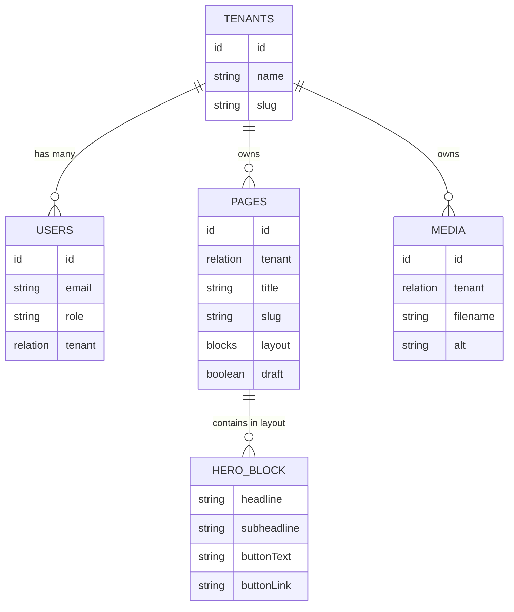
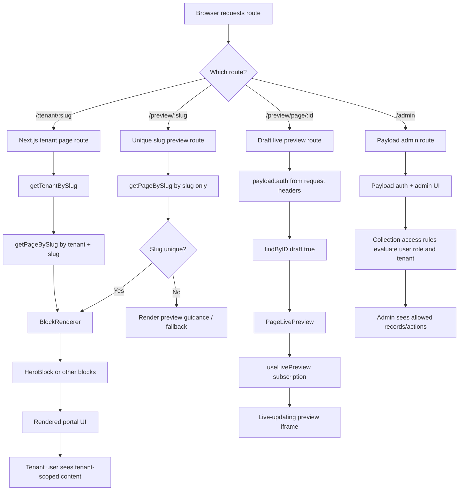
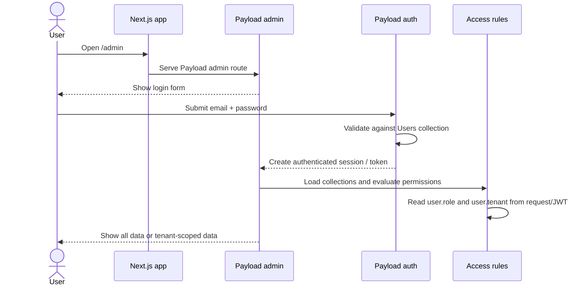
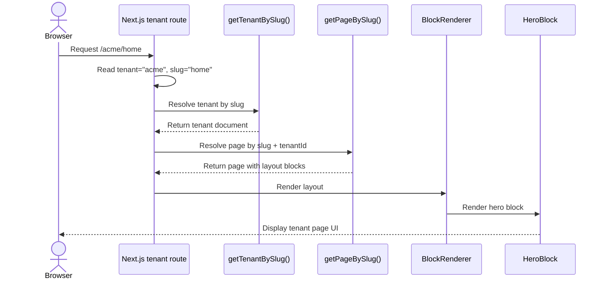
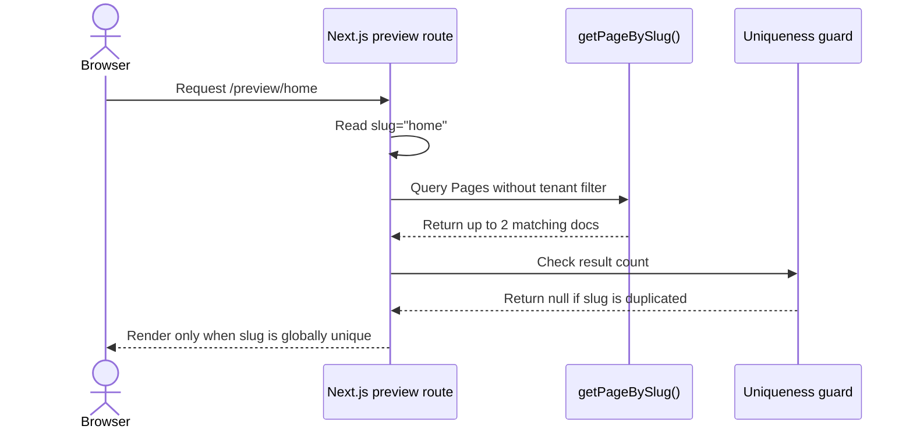
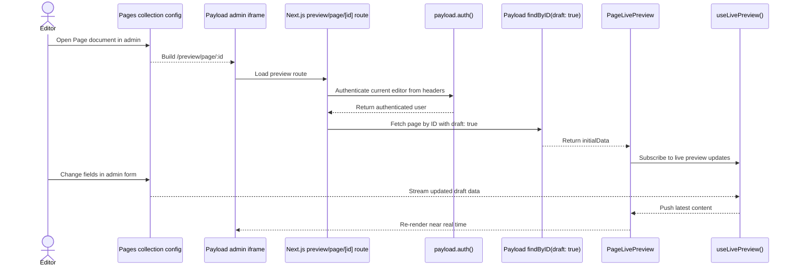
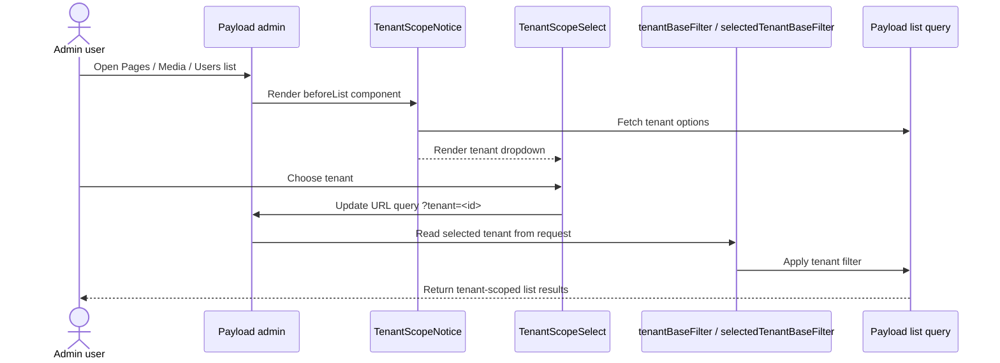

# Payload Next.js POC

This project is a multi-tenant **Payload CMS + Next.js** proof of concept built in `knowledge-hub/payload-nextjs-poc`.

It demonstrates:

- a shared Payload admin at `/admin`
- tenant-aware content ownership
- customer users authenticated through Payload
- block-based page building
- tenant-scoped frontend routing
- live preview for draft pages
- a shared UI layer powered by `@tanishraj/ui-kit`

---

## 1. What this POC is trying to prove

The POC answers a simple product question:

> Can one Payload instance power multiple customer tenants, while keeping content isolated and still giving each tenant a usable frontend portal?

This repo proves that it can.

At a high level:

1. **Super admins** manage all tenants, users, pages, and media.
2. **Customer users** belong to exactly one tenant.
3. **Pages** and **media** are linked to a tenant.
4. The frontend resolves URLs like `/acme/home`.
5. Payload access rules ensure tenant users can only read or manage their own tenant’s content.

---

## 2. Tech stack

- **Next.js 16** for the app shell and frontend routes
- **Payload CMS 3** for admin, auth, collections, access control, and live preview
- **SQLite** for lightweight local persistence
- **Lexical** as the configured Payload editor
- **`@tanishraj/ui-kit`** for frontend UI primitives
- **Vitest + Playwright** for test coverage

Main manifest: `package.json:1`

---

## 3. High-level architecture

```text
Browser
  │
  ├── /admin
  │     └── Payload admin UI
  │           ├── Users
  │           ├── Tenants
  │           ├── Pages
  │           └── Media
  │
  ├── /:tenant/:slug
  │     └── Next.js frontend page
  │           └── fetch page from Payload by tenant + slug
  │
  ├── /preview/:slug
  │     └── unique-slug preview route
  │
  └── /preview/page/:id
        └── Payload live preview route for draft editing
```

Core config lives in `src/payload.config.ts:1`.

---

## 4. Entity relationships



How to read it:

- one `Tenant` can have many `Users`
- one `Tenant` can own many `Pages`
- one `Tenant` can own many `Media` items
- one `Page` can contain block entries in `layout`
- right now the only implemented block type is `Hero`

---

## 5. Step-by-step: how the app is wired

### 5.1 Payload bootstraps everything

`src/payload.config.ts:1` is the entry point for the CMS.

It wires up:

- the SQLite adapter
- the Lexical editor
- generated TypeScript types
- the admin user collection
- all collections: `Tenants`, `Users`, `Media`, `Pages`

This is the file that makes Payload aware of the rest of the app.

---

### 5.2 Tenants are the root of isolation

`src/collections/Tenants.ts:1`

Each tenant has:

- `name`
- `slug`

The `slug` is important because it becomes part of the frontend URL:

- `acme` → `/acme/home`

Access model:

- admins can create, update, and delete tenants
- customer users can only read their own tenant

---

### 5.3 Users are auth users and carry tenant context

`src/collections/Users.ts:1`

This collection has Payload auth enabled:

- `auth: true`

Each user also stores:

- `role`: `admin` or `client`
- `tenant`: relationship to `tenants`

Important detail:

- both `role` and `tenant` are saved into the JWT with `saveToJWT: true`

That means later access checks can read the user’s tenant and role from the request context without re-fetching the user manually.

---

### 5.4 Pages belong to tenants and are built from blocks

`src/collections/Pages.ts:1`

Each page has:

- `tenant`
- `title`
- `slug`
- `layout`

The `layout` field is a **blocks** field.
Right now it supports:

- `Hero`

Block definition: `src/blocks/Hero.ts:1`

This is what allows editors to assemble content in the admin rather than hardcoding page markup.

Also important:

- `(tenant, slug)` is unique
- drafts are enabled via `versions.drafts: true`

That allows:

- `/acme/home`
- `/globex/home`

to coexist safely.

---

### 5.5 Media also belongs to tenants

`src/collections/Media.ts:1`

Uploads are tenant-scoped in the same way as pages:

- each media item has a required `tenant`
- the same access pattern is applied to media

This keeps uploaded assets aligned with the same ownership rules as content.

---

### 5.6 Access control is centralized

`src/access/tenantAccess.ts:1`

This file is the heart of the multi-tenant behavior.

It provides the helpers used across collections:

- `isAdminUser`
- `getTenantId`
- `getDefaultTenantValue`
- `isAdminAccess`
- `isAdminOrSelfAccess`
- `isAdminOrOwnTenantAccess`
- `canManageTenantContent`
- `canReadTenantContent`
- `tenantBaseFilter`
- `selectedTenantBaseFilter`

Conceptually:

- **admins** can see everything
- **clients** can only operate inside their tenant
- **base filters** narrow admin list views when a tenant is selected
- **access rules** protect API and admin operations

This keeps the logic reusable and prevents tenant rules from being duplicated across collections.

---

### 5.7 Tenant is auto-attached for customer users

`src/hooks/attachTenantFromUser.ts:1`

Before saving tenant-owned collections like `Pages` and `Media`:

1. Payload reads the current user from the request.
2. If the user is an admin, nothing is forced.
3. If the user is a client, their tenant is automatically attached to the document.

This prevents customer users from creating content outside their own tenant.

---

## 6. Frontend routing: how pages are resolved

### 6.1 Home page

`src/app/(frontend)/page.tsx:1`

This is the landing route for `/`.

Current behavior:

- if there is a global `home` page that resolves uniquely, render it
- otherwise show the instructional portal landing screen

The landing UI is composed via:

- `src/components/PortalHomeIntro.tsx:1`
- `src/components/LandingActions.tsx:1`
- `src/components/UIKitDemo.tsx:1`

---

### 6.2 Tenant page route

`src/app/(frontend)/[tenant]/[slug]/page.tsx:1`

This is the main customer portal route.

Flow:

1. Read `tenant` and `slug` from the URL.
2. Resolve the tenant using `getTenantBySlug`.
3. Resolve the page using `getPageBySlug({ slug, tenantId })`.
4. If page exists, render its layout.
5. If not, return `notFound()`.

Helpers involved:

- `src/lib/getTenantBySlug.ts:1`
- `src/lib/getPageBySlug.ts:1`

This route is the clearest example of tenant-aware frontend rendering.

---

### 6.3 Unique slug preview route

`src/app/(frontend)/preview/[slug]/page.tsx:1`

This route is more permissive:

- it tries to resolve a page only by slug

To avoid ambiguity:

- `getPageBySlug` allows up to 2 results when no tenant is provided
- if more than one page shares the slug across tenants, it returns `null`

That means `/preview/home` only works when `home` is globally unique.

---

### 6.4 Draft preview route used by Payload

`src/app/(frontend)/preview/page/[id]/page.tsx:1`

This route is used for Payload’s live preview iframe.

Flow:

1. Read the Payload auth session from request headers.
2. Ensure a user is logged in.
3. Fetch the page by ID with `draft: true`.
4. Hand the result to `PageLivePreview`.

Client preview component:

- `src/components/live-preview/PageLivePreview.tsx:1`

That client component uses:

- `useLivePreview`
- `RefreshRouteOnSave`

from `@payloadcms/live-preview-react`.

So when an editor changes a draft in Payload, the iframe updates in real time.

---

## 7. Rendering flow: from stored block data to UI

### 7.1 Block definition in Payload

`src/blocks/Hero.ts:1`

Editors configure:

- headline
- subheadline
- button text
- button link

### 7.2 Block renderer

`src/components/BlockRenderer.tsx:1`

This takes `layout` from a page and maps over its blocks.

Right now:

- if `blockType === 'hero'`, render `HeroBlock`

### 7.3 React block implementation

`src/components/blocks/HeroBlock.tsx:1`

This is the frontend UI for the Hero block.

So the content flow is:

```text
Payload admin block form
  → stored in Pages.layout
  → fetched by Next.js route
  → passed into BlockRenderer
  → rendered by HeroBlock
```

---

## 8. Admin tenant scoping helpers

Two custom admin components support tenant scoping in list views:

- `src/components/admin/TenantScopeNotice.tsx:1`
- `src/components/admin/TenantScopeSelect.tsx:1`

How they work:

1. Admin opens a list view for Pages, Media, or Users.
2. Payload renders `beforeList`.
3. `TenantScopeNotice` fetches tenants and renders a select.
4. `TenantScopeSelect` updates the URL query string with `?tenant=...`.
5. `tenantBaseFilter` / `selectedTenantBaseFilter` use that query param to narrow the admin list.

This is an admin convenience layer, not a security layer.
The real protection still comes from collection access rules.

---

## 9. UI layer

The frontend now uses shared UI primitives from:

- `@tanishraj/ui-kit`

Examples:

- buttons and actions
- badges
- empty states
- text/typography
- modal demo

Main UI composition files:

- `src/components/PortalButtonLink.tsx:1`
- `src/components/PortalEmptyState.tsx:1`
- `src/components/PortalHomeIntro.tsx:1`
- `src/components/UIKitDemo.tsx:1`

Frontend styling entry:

- `src/app/(frontend)/styles.css:1`

This keeps the POC looking closer to a product portal rather than a default scaffold.

---

## 10. End-to-end content lifecycle

Here is the full editorial flow.

### 10.1 Initial setup

1. Start the app.
2. Go to `/admin`.
3. Create the first admin user.

### 10.2 Create a tenant

1. Open `Tenants`.
2. Create a tenant like:
   - name: `Acme Bakery`
   - slug: `acme`

### 10.3 Create a customer user

1. Open `Users`.
2. Create a user with:
   - role: `Customer`
   - tenant: `Acme Bakery`

### 10.4 Create a page

1. Open `Pages`.
2. Create a page:
   - title: `Home`
   - slug: `home`
   - tenant: `Acme Bakery`
3. Add a `Hero Section` block.
4. Publish the page.

### 10.5 View the portal page

Open:

- `http://localhost:3000/acme/home`

What happens:

1. Next reads `tenant=acme` and `slug=home`.
2. Tenant is resolved.
3. Page is resolved inside that tenant.
4. `layout` is rendered.

---

## 11. Local development

### Install

```bash
cd payload-nextjs-poc
npm install
```

### Run dev server

```bash
npm run dev
```

### Useful scripts

```bash
npm run build
npm run lint
npm run test
npm run test:int
npm run test:e2e
npm run generate:types
npm run generate:importmap
```

Scripts live in `package.json:1`.

---

## 12. Important environment variables

This POC expects the usual Payload runtime values, especially:

- `PAYLOAD_SECRET`
- `DATABASE_URL`
- `NEXT_PUBLIC_SERVER_URL`

Usage examples in code:

- Payload secret/database: `src/payload.config.ts:1`
- preview URL generation: `src/collections/Pages.ts:1`
- live preview client fallback: `src/components/live-preview/PageLivePreview.tsx:1`

---

## 13. Important files and what they do

### Core config

- `src/payload.config.ts:1` — main Payload setup
- `src/payload-types.ts:1` — generated Payload types

### Collections

- `src/collections/Tenants.ts:1` — tenant model
- `src/collections/Users.ts:1` — auth users + tenant + role
- `src/collections/Pages.ts:1` — tenant-owned pages with blocks
- `src/collections/Media.ts:1` — tenant-owned uploads

### Access and hooks

- `src/access/tenantAccess.ts:1` — shared tenant access logic
- `src/hooks/attachTenantFromUser.ts:1` — auto-attach tenant for client users

### Blocks and rendering

- `src/blocks/Hero.ts:1` — Payload block schema
- `src/components/BlockRenderer.tsx:1` — block switchboard
- `src/components/blocks/HeroBlock.tsx:1` — Hero frontend implementation

### Frontend routes

- `src/app/(frontend)/page.tsx:1` — landing page
- `src/app/(frontend)/[tenant]/[slug]/page.tsx:1` — tenant portal page
- `src/app/(frontend)/preview/[slug]/page.tsx:1` — unique slug preview route
- `src/app/(frontend)/preview/page/[id]/page.tsx:1` — draft live preview route

### Admin UX helpers

- `src/components/admin/TenantScopeNotice.tsx:1`
- `src/components/admin/TenantScopeSelect.tsx:1`

### Frontend UI helpers

- `src/components/PortalHomeIntro.tsx:1`
- `src/components/PortalButtonLink.tsx:1`
- `src/components/PortalEmptyState.tsx:1`
- `src/components/UIKitDemo.tsx:1`
- `src/components/LandingActions.tsx:1`

---

## 14. What is intentionally simple in this POC

This repo is deliberately lightweight.

Examples:

- SQLite instead of Postgres
- only one real content block (`Hero`)
- simple tenant resolution by URL slug
- minimal media model
- limited frontend page types

That is good for a POC because it keeps the architecture easy to inspect.

---

## 15. Suggested next improvements

If this POC grows, the next logical steps are:

1. add more block types
2. add richer media usage inside blocks
3. add tenant branding/theme settings
4. add invitation or password reset flows
5. add customer-facing login pages outside Payload admin if needed
6. move from SQLite to Postgres for shared environments
7. add audit logging or publishing workflows

---

## 16. Quick mental model

If you only remember one thing, remember this:

```text
Tenant
  owns Users
  owns Pages
  owns Media

Pages
  contain Blocks

Frontend routes
  resolve Tenant + Page

Access rules
  enforce isolation

Live Preview
  shows draft content in Next.js
```

That is the whole POC in one picture.

---

## 17. Sequence diagrams / request flow

This section shows the most important runtime flows in sequence form.

### 17.0 Request lifecycle at a glance



What this diagram shows:

- Next.js owns the route entry points
- Payload owns auth, admin, collections, and access control
- frontend rendering is driven by Payload data
- tenant-specific pages flow through tenant resolution before rendering
- live preview uses a separate authenticated preview path

---

### 17.1 Admin login flow



What matters here:

- the `Users` collection is the auth source
- `role` and `tenant` are saved into JWT
- later collection access rules use that request context directly

---

### 17.2 Tenant page rendering flow

Example URL:

```text
/acme/home
```



What matters here:

- tenant resolution happens first
- page lookup is tenant-aware
- rendering is driven by saved block data, not hardcoded page content

---

### 17.3 Unique slug preview flow

Example URL:

```text
/preview/home
```



What matters here:

- this route is intentionally conservative
- it avoids showing the wrong tenant’s content when slugs are duplicated

---

### 17.4 Live preview rendering flow

This is the draft preview flow used inside Payload admin.



What matters here:

- live preview uses the page ID, not the public slug route
- draft content is fetched with `draft: true`
- the preview route requires an authenticated Payload user

---

### 17.5 Admin tenant filtering flow

This is the list-view filtering convenience used by admins.



What matters here:

- this improves the admin workflow
- it does not replace access control
- real security still comes from collection access rules
